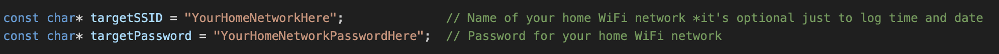
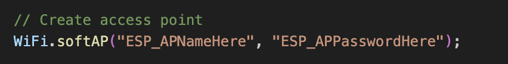
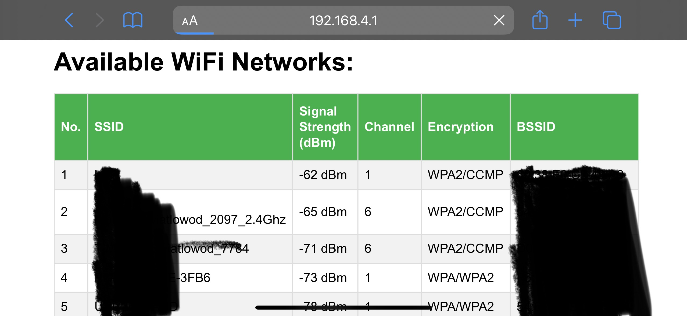
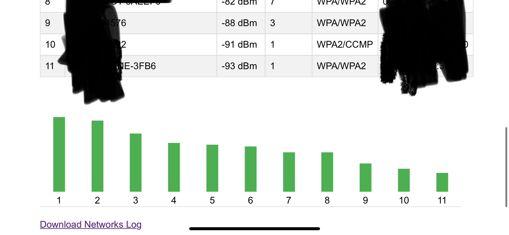
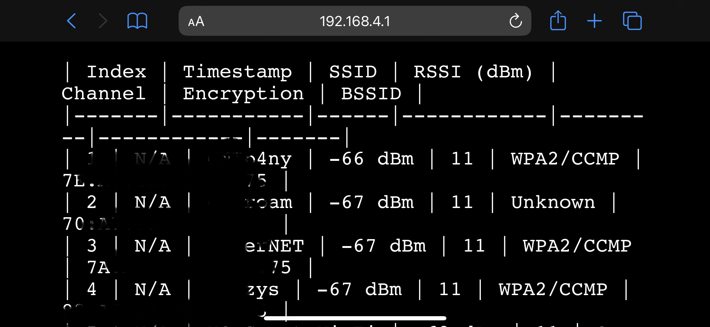

# sturdy-sniffle
simple software for esp board to sniff and colect discovered WiFi's.

It's logging:
- WiFi SSID
- Signal strenght in dBm
- Channel
- Encryption type
- BSSID


All above is writen in to a file ```networks.txt``` and can be downloaded.
Only new discovered networks are stored in log file no duplicated entries.
After uploading the software and turning it on for the first time, the LED lights up permanently, as soon as someone is browsing the UI, the LED starts blinking 3 times, showing that someone is browsing (connected).


## First Steps:

edit credetials to access your home network 

(optional to gain date and time for log file)

edit credentials for access point on ESP


and bake you ESP using Arduino IDE or VSCode.


# Screen Shots
### Interface
 


### Log file
Can bo downloaded

